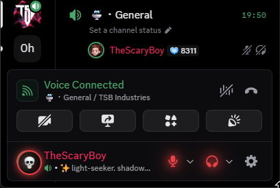
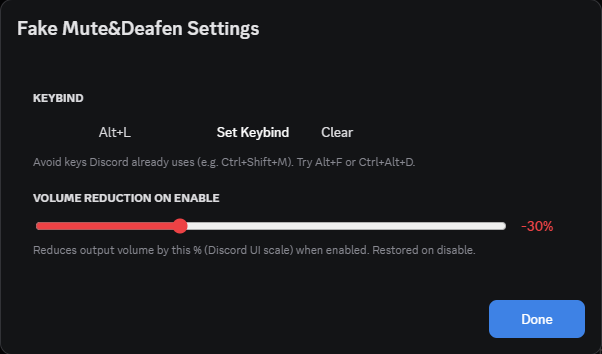

# 💀 Fake Mute&Deafen

Appear muted/deafened to the server while still being able to speak and hear everyone locally.

## 🚀 Features

  
  &nbsp;
  

- 💀 Draggable floating skull button — red when active, green when off
- 🔴 Glow indicators on the mute/deafen buttons when locks are active
- ⌨️ Configurable keybind
- 🔉 Configurable volume reduction on enable, fully restored on disable
- 📐 Button position saved as % of window — stays in place across different monitor resolutions

## 🔧 How it works

- **Fake Mute** — The server sees you as muted. Your mic stays open and transmits audio normally.
- **Fake Deafen** — The server sees you as deafened. You can still hear everyone in the channel.

The plugin intercepts the gateway socket's voice state update before it reaches Discord's servers, forcing `selfMute` and `selfDeaf` to stay `true` regardless of what you click locally.

## ⚙️ Usage

1. Mute and/or deafen yourself in Discord normally
2. Click the 💀 skull button (or your keybind) to enable — the server locks your state
3. Click mute/deafen again — your mic opens and audio plays locally, server stays muted/deafened
4. Click the skull again to disable — everything restores to normal

Navigate to `BetterDiscord > Plugins > Fake Mute&Deafen Settings` to:
- Set a custom keybind
- Configure volume reduction % on enable

If you encounter any problems, please [open an issue](https://github.com/TheScaryBoy/BetterDiscord-Plugins/issues).

## ⚠️ Note

Discord occasionally updates its internal module structure. If the plugin stops working after a Discord update, the module IDs at the top of the plugin file may need updating. Check the [issues page](https://github.com/TheScaryBoy/BetterDiscord-Plugins/issues) or open a new one.

## 🌟 Show your support

Give a ⭐️ if this project helped you!
